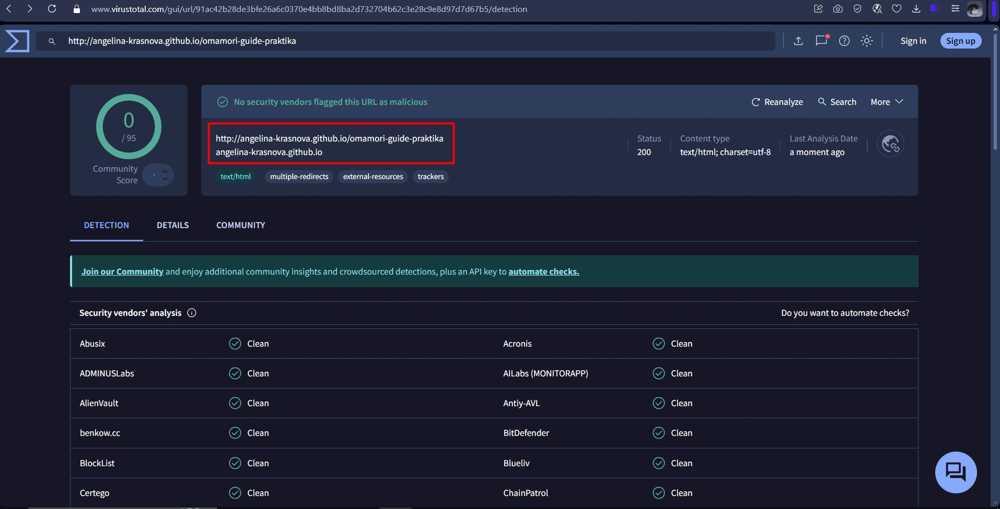

# Отчет о безопасности веб-приложения «Omamori Guide»

**Дата проведения анализа:** 19.03.2026  
**Исполнитель:** Краснова А.Н.

## 1. Анализ источников угроз

| Угроза | Актуальность для проекта | Обоснование |
|--------|--------------------------|-------------|
| SQL-инъекции | Низкая | Сайт статический, база данных не используется (данные хранятся в JSON-файлах). |
| XSS-атаки | Низкая | Пользовательский ввод отсутствует (нет форм). Единственный источник данных — URL-параметры, которые используются только для поиска в JSON и не вставляются в DOM напрямую через innerHTML |
| Подбор паролей | Неактуально | Отсутствуют формы авторизации и админ-панель. |
| DDoS-атаки | Средняя | Теоретически возможны, но сайт размещен на GitHub Pages, который имеет защиту от массовых атак. |
| Кража данных | Низкая | Не хранятся пользовательские данные. |

## 2. Реализованные меры защиты

| Мера защиты | Реализация |
|-------------|------------|
| **HTTPS** | Сайт работает по защищенному протоколу (GitHub Pages предоставляет SSL-сертификат автоматически) |
| **Защита от XSS** | Все данные, подставляемые в HTML, поступают из локального JSON-файла, контролируемого разработчиком. URL-параметры используются только для поиска в данных и не вставляются в DOM как HTML |
| **Проверка на вредоносный код** | Проект просканирован через VirusTotal (скриншот прилагается) — угроз не обнаружено |

## 3. Выводы

Веб-приложение «Omamori Guide» является статическим сайтом, что минимизирует риски безопасности. Основные векторы атак (SQL-инъекции, XSS) нереализуемы в силу архитектуры. Реализованные меры (HTTPS, CSP, безопасные методы работы с DOM) соответствуют базовым требованиям безопасности для статических ресурсов. Сайт может быть рекомендован к эксплуатации.